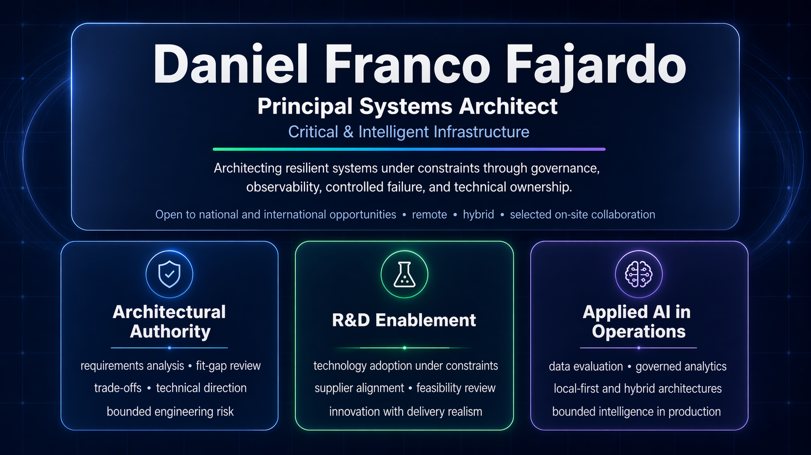
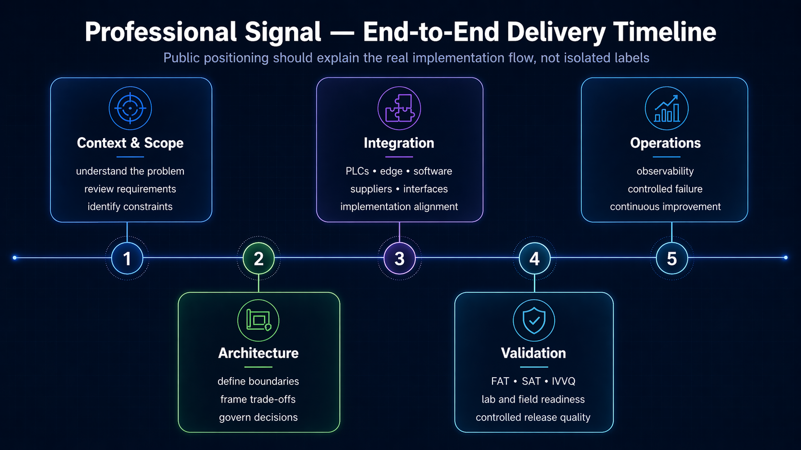
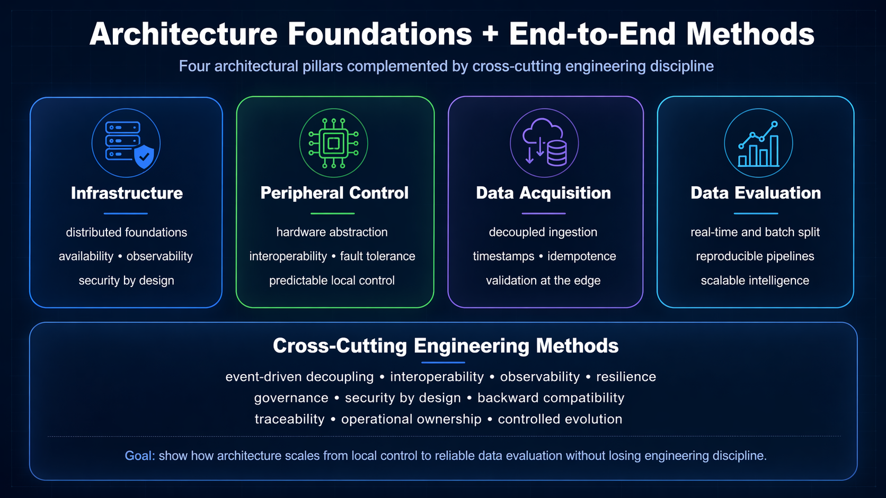



# Daniel Franco Fajardo

### Principal Systems Architect Critical & Intelligent Infrastructure

**Designing resilient systems under constraints with observability, control, and stewardship.**

 

&nbsp;

&nbsp;

  

---

I design and govern systems that must remain reliable under real-world constraints across software, automation, edge infrastructure, and applied intelligence.

My value is not technology theater. It is architectural judgment under operational constraints.

## Professional Positioning

I work at the intersection of architecture, operational reliability, and controlled technology adoption.

My focus is not isolated software delivery. It is the design of systems that must remain understandable, maintainable, and defensible when uptime, integration risk, compliance pressure, and deployment reality matter.

I contribute where technical scope, operational behavior, and delivery constraints must be translated into implementable architecture.

## Core Signals

- **9+ years** across mission-critical transportation and industrial environments
- **Former Product Design Authority (PDA)** for railway, tolling, and traffic-control platforms
- international technical coordination across **France, Italy, and Mexico**
- integration across **PLCs, Modbus, sensors, SBCs, edge devices, software platforms, and validation environments**
- applied work in **requirements analysis, gap evaluation, design trade-offs, R&D-oriented technology adoption, and operational validation**
- experience supporting **technical proposals, compliance matrices, punch lists, supplier alignment, and executive / non-technical presentations**
- **M.Sc. in Artificial Intelligence** coursework completed; degree process underway

## Proof Pillars

### Critical Systems
Systems where uptime, continuity, fault handling, and maintainability matter.

### Architectural Authority
System-level decisions, technical trade-offs, requirements framing, and risk-controlled implementation.

### R&D / Technology Adoption
Evaluation of new technologies inside real delivery constraints, not detached experimentation.

### Applied AI in Operations
Applied intelligence used as a bounded subsystem within governed operational environments.

  

## What I Actually Do

This operating profile combines technical direction, validation discipline, and controlled delivery.

### Requirements and Gap Analysis
I translate operational needs, bid constraints, and technical gaps into implementable system boundaries.

### Trade-Offs and Decision Framing
I frame decisions around reliability, maintainability, cost, integration risk, and long-term operational behavior.

### Tendering and Compliance
I support solution definition, technical annex interpretation, compliance alignment, and bid-oriented architecture shaping.

### Integration and Validation
I work across PLCs, edge devices, software platforms, interfaces, and validation environments to reduce deployment uncertainty.

### Operational Reliability
I prioritize observable, governable systems that fail predictably and remain defensible under real-world conditions.

  

<em>Architecture, control, acquisition, evaluation, and delivery discipline are presented as one coherent implementation stack.</em>

## Professional Experience Highlights

- Improved PLC-based vehicle classification effectiveness by **25%** through logic optimization, process standardization, and validation improvements
- Designed and implemented a **Semi Stop & Go** solution for elevated urban highway operations
- Built real-time turnstile counting systems with **Modbus communication, offline buffering, alerting, and fault-tolerant handling**
- Developed a **PLC event simulator with Raspberry Pi** to reduce test time and improve repeatability
- Contributed to **R&D-oriented evaluation of advanced sensing and applied intelligence** without separating innovation from deployment constraints

## Public Evidence

Start with the integrated portfolio for a concise, evidence-linked review of four bounded public demonstrations. The domain repositories provide the underlying technical detail and validation context. Earlier public work remains available as additional evidence.

| Start here | Role | What you will find | Direct link |
|---|---|---|---|
| **Engineering Portfolio** | Primary integrated proof | Zero-dependency review surface connecting validated OT resilience, governed data, AI assurance and traceable architecture decisions. | [Open portfolio](https://github.com/RelativoDrako/engineering-portfolio) |
| **Architecture Decision Workbench** | Architecture decision proof | Requirements, alternatives, fit-gap, trade-offs, verification mapping and sensitivity replay in a synthetic advisory scenario. | [Open repository](https://github.com/RelativoDrako/architecture-decision-workbench) |
| **Industrial Resilience OT Lab** | Resilient operations proof | Synthetic fault-aware control, controlled degradation and recovery, observable state, validation and deterministic replay. | [Open repository](https://github.com/RelativoDrako/industrial-resilience-ot-lab) |
| **Governed AI Assurance** | Assurance proof | Evidence grounding, citation checks, controlled abstention, human review and replay in a bounded synthetic corpus. | [Open repository](https://github.com/RelativoDrako/governed-ai-assurance) |
| **Governed Data & Analytics** | Data governance proof | Contract-based admission, quarantine, quality, lineage and trusted KPI outputs from a bounded synthetic dataset. | [Open repository](https://github.com/RelativoDrako/governed-data-analytics) |

### Additional Public Evidence

| Reference | Role | Direct link |
|---|---|---|
| **Probabilistic Seismic Risk Prototype** | Additional bounded technical proof | [Open repository](https://github.com/RelativoDrako/probabilistic-seismic-risk-prototype) |
| **inventory-stream7-rescue** | Additional operational tooling proof | [Open repository](https://github.com/RelativoDrako/inventory-stream7-rescue) |
| **EdgeResilienceLab** | Publishable architecture work in progress | [Open repository](https://github.com/RelativoDrako/edge-resilience-lab) |
| **Professional Landing Page** | Professional navigation and contact surface | [Open landing](https://relativodrako.github.io/) |

## Professional Boundary

This profile presents selected public architectural references and bounded prototypes.

It does not expose proprietary client code, confidential data, official warning systems, or production operational platforms.

## Contact

- Email:     **relativomec@gmail.com** 
- LinkedIn:  **[linkedin.com/in/daniel-franco-b27572a8](https://linkedin.com/in/daniel-franco-b27572a8)**
- Landing:   **[relativodrako.github.io](https://relativodrako.github.io/)**

---
  > Architecture is not only about building systems. It is about governing how systems behave under uncertainty.
